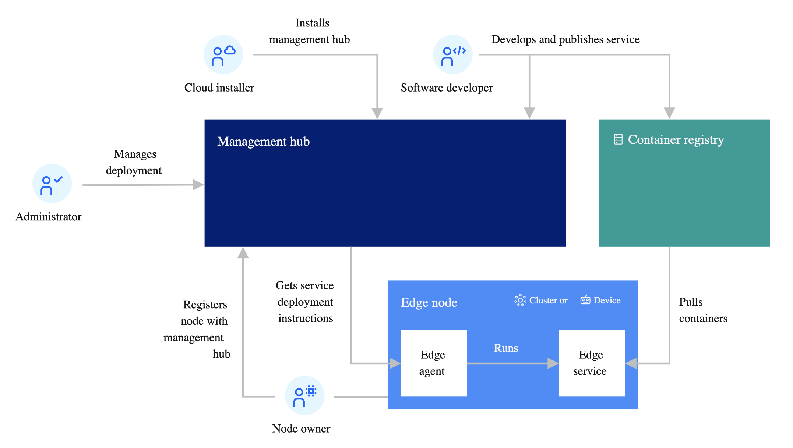
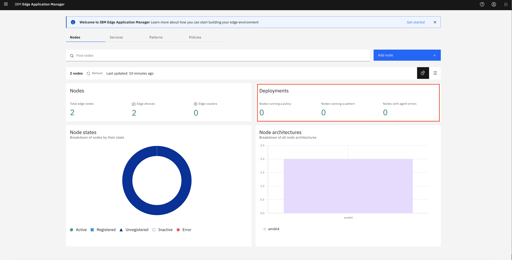
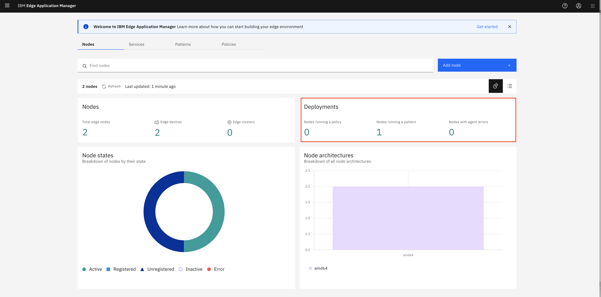

# IBM Edge Application Manager 101

IEAM provides you with edge computing features to help you manage and deploy workloads from a management hub cluster to edge devices and remote instances of OpenShift Container Platform or other Kubernetes-based clusters.


## Architecture

The goal of edge computing is to harness the disciplines that have been created for hybrid cloud computing to support remote operations of edge computing facilities. IEAM is designed for that purpose.

The deployment of IEAM includes the management hub that runs in an instance of OpenShift Container Platform installed in your data center. The management hub is where the management of all of your remote edge nodes (edge devices and edge clusters) occurs.

These edge nodes can be installed in remote on-premises locations to make your application workloads local to where your critical business operations physically occur, such as at your factories, warehouses, retail outlets, distribution centers, and more.

The following diagram depicts the high-level topology for a typical edge computing setup:

  

The IEAM management hub is designed specifically for edge node management to minimize deployment risks and to manage the service software lifecycle on edge nodes fully autonomously. A Cloud installer installs and manages the IEAM management hub components. Software developers develop and publish edge services to the management hub. Administrators define the deployment policies that control where edge services are deployed. IEAM handles everything else.


## Components

IBM Edge Application Manager (IEAM) includes several components that are bundled with the product. Below are the components in IEAM v4.3.

- IBM Cloud Platform Common Services(v3.6.x) - This is a set of foundational components that are installed automatically as part of the IEAM operator installation.
- Agbot(v2.29.0-595) - Agreement bot (agbot) instances are created centrally and are responsible for deploying workloads and machine learning models to IEAM.
- MMS(v1.5.3-338) - The Model Management System (MMS) facilitates the storage, delivery, and security of models, data, and other metadata packages needed by edge services. This enables edge nodes to easily send and receive models and metadata to and from the cloud.
- Exchange API(v2.87.0-531) - The Exchange provides the REST API that holds all the definitions (patterns, policies, services, and so on) used by all the other components in IEAM.
- Management console(v1.5.0-578) - The web UI used by IEAM administrators to view and manage the other components of IEAM.
- Secure Device Onboard(v1.11.11-441) - The SDO component enables technology that is created by Intel to make it simple and secure to configure edge devices and associate them with an edge management hub.
- Cluster Agent(v2.29.0-595) - This is a container image, which is installed as an agent on edge clusters to enable node workload management by IEAM.
- Device Agent(v2.29.0-595) - This component is installed on edge devices to enable node workload management by IEAM.
- Secrets Manager(v1.0.0-168) - The Secrets Manager is the repository for secrets deployed to edge devices, enabling services to securely receive credentials used to authenticate to their upstream dependencies.


## Pre-requisites

IEAM hub has been deployed on a OpenShift cluster and IEAM agent has been deployed on at least one edge node.

Deployment of IEAM hub and agent is not in the scope of this repo. Detail deployment instructions of IEAM v4.3 are available at
- [Installing the management hub](https://www.ibm.com/docs/en/edge-computing/4.3?topic=installing-management-hub)
- [Installing edge nodes](https://www.ibm.com/docs/en/edge-computing/4.3?topic=installing-edge-nodes)

IEAM v4.3 system is used while dveloping this repo.


## Steps

The exercise helps you understand
- deploy IEAM policies using patterns
- deploy IEAM policies using policies
- CI/CD process for creating edge services
- Secrets Management
- Model Management

- zero touch IEAM agent deployment and registering of SDO (Secure Device Onboard) device
- Cluster agent

IEAM hub should have been deployed before you start the exercise. VM machines running Ubuntu v20.x are used to simulate a edge node for the remaining of the exercise. For a full list of supported edge nodes, refer to [Supported architectures and operating systems](https://www.ibm.com/docs/en/edge-computing/4.3?topic=devices-preparing-edge-device).


### Step 1 - Preparing Working Environment on Edge Node

Before you can work with your edge node, you need to prepare a shell environment.

> Note: In case the shell terminal times out during your exercise, the steps in this section must be retaken.

1. Connect to your edge node.

    ```
    ssh root@<your edge node IP/hostname>
    ```

1. Login to your edge node when prompted.

1. Go to your IEAM agent deployment folder.

1. Three environment variables must be set in order to operate on your edge node successfully.
    - HZN_ORG_ID
    - HZN_FSS_CSSURL
    - HZN_EXCHANGE_USER_AUTH

    > Note: the value of environment variable `HZN_EXCHANGE_USER_AUTH` is in format of `iamapikey:<horizon-API-key>`.

1. As part of the infrasctucture installation process for IBM Edge Computing Manager, File `./agent-install.cfg` was created in the current folder of each edge node. It can contain the value for the above environment variables. For the values that are not available in the file, you can get them from your system administrator.

1. Set environment variables.

    ```
    export HZN_ORG_ID=[your org ID]
    export HZN_FSS_CSSURL=[your exchange and css url]
    export HZN_EXCHANGE_USER_AUTH=[your crenetial]
    ```

1. Verify environment variable `HZN_ORG_ID` and `HZN_FSS_CSSURL`.

    ```
    echo $HZN_ORG_ID
    echo $HZN_FSS_CSSURL
    echo $HZN_EXCHANGE_USER_AUTH
    ```

    > Note: In case the shell terminal times out during your exercise, the steps in this section must be retaken.

1. Verify your horizon environment is setup properly.

    ```
    hzn exchange user list
    ```

1. Sample successsful output looks like

    ```
    hzn exchange user list

    {
      "$HZN_ORG_ID/admin": {
        "password": "********",
        "email": "admin@does.not.exist.com",
        "admin": true,
        "hubAdmin": false,
        "lastUpdated": "2021-10-08T14:12:02.520447Z[UTC]",
        "updatedBy": "root/root"
      }
    }
    ```


### Step 2 - Cloning the Repo

To clone this repo,

1. In your shell of the edge node.

1. Clone the repo.

    ```
    cd  ~
    git clone https://github.com/lee-zhg/ieam101.git
    cd  ieam101
    ```


### Step 3 - Accessing Edge Console

Edge console can help visualize your edge nodes in the environment.

1. In your shell of the edge node.

1. Identify the content of environment variable `HZN_FSS_CSSURL`.

    ```
    echo $HZN_FSS_CSSURL
    ```

1. The sample output of the above command looks like

    ```
    https://cp-console.itzroks-1000003bw1-0l4f16-6ccd7f378ae819553d37d5f2ee142bd6-0000.us-east.containers.appdomain.cloud/edge-css
    ```

1. Remove `-css` from your output and remaining content is the URL to access your Edge Console. For example,

    ```
    https://cp-console.itzroks-1000003bw1-0l4f16-6ccd7f378ae819553d37d5f2ee142bd6-0000.us-east.containers.appdomain.cloud/edge
    ```

1. Access the Edge Console in a browser.

    


### Step 4 - Deploying Service onto Edge Node using Patterns

Using a deployment pattern is a straightforward and simple way to deploy a service to your edge node. You specify the top-level service, or multiple top-level services, to be deployed to your edge node and IEAM handles the rest, including the deployment of any dependent services your top-level service might have.

1. In your shell of the edge node.

1. Unregister your node. This ensures you start in a clean environment.

    ```
    hzn unregister -f
    ```

1. Verify that there is nothing going-on on the edge node.

    ```
    hzn agreement list
    ```

1. You can also verify in the Edge console.

    

1. Register your edge node by using the `helloworld` pattern.

    ```
    hzn register -p IBM/pattern-ibm.helloworld -s ibm.helloworld --serviceorg IBM
    ```

    > Note: using the -s flag with the hzn register command will cause Horizon to wait until agreements are formed and the service is running on your edge node to exit, or alert you of any errors encountered during the registration process.

1. The successful output looks like

    ```
    hzn register -p IBM/pattern-ibm.helloworld -s ibm.helloworld --serviceorg IBM

    Horizon Exchange base URL: https://cp-console.itzroks-1000003bw1-0l4f16-6ccd7f378ae819553d37d5f2ee142bd6-0000.us-east.containers.appdomain.cloud/edge-exchange/v1
    Using node ID 'itzvsi-48y6dp6p' from the Horizon agent
    Generated random node token
    Updating node token...
    Will proceeed with the given pattern IBM/pattern-ibm.helloworld.
    Initializing the Horizon node with node type 'device'...
    Note: no input file was specified. This is only valid if none of the services need variables set.
    However, if there is 'userInput' specified in the node already in the Exchange, the userInput will be used.
    Changing Horizon state to configured to register this node with Horizon...
    Horizon node is registered. Workload services should begin executing shortly.
    Waiting for up to 60 seconds for following services to start:
      IBM/ibm.helloworld
    Status of the services you are watching:
      IBM/ibm.helloworld 	Progress so far: no agreements formed yet
    Status of the services you are watching:
      IBM/ibm.helloworld 	Progress so far: agreement proposal has been received
    Status of the services you are watching:
      IBM/ibm.helloworld 	Progress so far: agreement is finalized
    Status of the services you are watching:
      IBM/ibm.helloworld 	Progress so far: execution is started

    Status of the services you are watching:
      IBM/ibm.helloworld 	Success
    ```

1. Verify service `helloworld` is running on your edge node.

    ```
    hzn agreement list
    ```

1. Sample output

    ```
    hzn agreement list

    [
      {
        "name": "pattern-ibm.helloworld_ibm.helloworld_IBM_amd64 merged with pattern-ibm.helloworld_ibm.helloworld_IBM_amd64",
        "current_agreement_id": "72b9a11219a46d2ab940cf9966df9874e8d5dc6e4c5bcfe911046030ba39391a",
        "consumer_id": "IBM/agbot",
        "agreement_creation_time": "2021-10-13 20:06:19 +0000 UTC",
        "agreement_accepted_time": "2021-10-13 20:06:28 +0000 UTC",
        "agreement_finalized_time": "2021-10-13 20:06:29 +0000 UTC",
        "agreement_execution_start_time": "2021-10-13 20:06:30 +0000 UTC",
        "agreement_data_received_time": "",
        "agreement_protocol": "Basic",
        "workload_to_run": {
          "url": "ibm.helloworld",
          "org": "IBM",
          "version": "1.0.0",
          "arch": "amd64"
        }
      }
    ]
    ```

1. After the agreement is made, list the docker container edge service that has been started as a result. To check out the running container(s) on the edge node,

    ```
    ps docker ps
    ```

1. To check out the helloworld service output,

      ```
      hzn service log -f ibm.helloworld
      ```

    > Note: Press Ctrl-C to stop the command output.

1. Optionally, you may also check the node status via the Edge Console.

    
  
1. Unregister your edge node (which will also stop the `helloworld` service),

    ```
    hzn unregister -f
    ```


### Step 5 - Creating IEAM Service via CI/CO Pipeline

In this section, you create a new IEAM service `web-hello-python` that runs a containerized HTTP server workload on your edge device when deployed. The [web-hello-python](https://github.com/TheMosquito/web-hello-python) example is an extremely simple HTTP server (written in Python) that responds on port 8000 with a hello message.

The core principle of IBM Edge Application Manager is to orchestrate containizered workloads, at scale, on edge devices.  Edge developers should be familiar with creating Docker containers optimized for (CPU/Memory/Power) constrained devices.  This example builds a small container, pushes it to your Docker Hub registry and creates a service and pattern in the IEAM exchange hub.

1. In your shell of the edge node.

1. Clone the source github repository:

    ```
    cd  ~
    git clone https://github.com/TheMosquito/web-hello-python
    cd  web-hello-python
    ```

1. Log into your Docker Hub account so the container can be hosted for edge deployment

    ```
    docker login
    ```

1. Edit `Makefile` and change the following lines. 

    ```
    DOCKERHUB_ID:=<your docker registry account>
    SERVICE_NAME:="web-hello-python-<yourname>"
    SERVICE_VERSION:="1.0.0"
    PATTERN_NAME:="pattern-web-hello-python-<yourname>"
    ```

    > Note: If you plan to push it to a Docker registry, make sure you give your docker ID. 
  
    > Note: You may also want to create unique names for your service and pattern (specially when you are doing exercis in the multi-tenant IEAM instance that is shared with other lab participants and you are all publishing this service).

1. Create a hzn cryptographic signing keys. All edge services and deployment patterns must be cryptographically signed. 

    ```
    hzn key create <your company> <your email>
    ```

1. The above command creates two files.
    - ~/.hzn/keys/service.private.key
    - ~/.hzn/keys/service.public.pem

1. Pckage the source codes and build the container.

    ```
    make build
    ```

1. Push the new container to the Docker registry.

    ```
    make push
    ```

1. Publish a new IEAM service.

    ```
    make publish-service
    ```

1. Verify service `web-hello-python-<your name>` was created.

    ```
    hzn exchange service list
    ```

    > Note: write down the new service name. For example, `<your-org-id>/web-hello-python-<your name>_1.0.0_amd64`.

1. Publish a new IEAM pattern.

    ```
    make publish-pattern
    ```

1. Verify pattern `web-hello-python-<your name>` was created.

    ```
    hzn exchange pattern list
    ```

    > Note: write down the new pattern name. For example, `your-org-id/pattern-web-hello-python-<your name>`.

1. If you are running any pattern on your specific Horizon edge node, you will need to unregister the prior IEAM pattern. Remember, only one deployment pattern can be registered on an edge node.

    ```
    hzn unregister -f
    ```

1. Deploy the new `web-hello-python-<your name>` service to your edge node via pattern via the pipeline.

    ```
    make agent-run
    ```

1. Verify service helloworld is running on your edge node.

    ```
    hzn agreement list
    ```

1. Verify that the new `web-hello-python-<your name>` service is running on your edge node.

    - Test your containerize workload by opening a browser session to http://localhost:8000
    - Test the container via curl comand

      ```
      curl -sS http://localhost:8000

      <!DOCTYPE html>

      <html>
      <head>

      <meta charset="utf-8">

      <title>WebHello</title>

      </head>
      <body>
      Hello, "172.17.0.1".
      </body>
      </html>
      ```

1. Unregister your edge node (which will also stop the new `web-hello-python-<your name>` service),

    ```
    hzn unregister -f
    ```

1. Register your edge node by using the `$HZN_ORG_ID/pattern-web-hello-python-<your name>` pattern in the IEAM hub.

    ```
    hzn register -p $HZN_ORG_ID/pattern-web-hello-python-<your name> -s "web-hello-python-<your name>" --serviceorg $HZN_ORG_ID
    ```

    For exaample,

    ```
    hzn register -p $HZN_ORG_ID/pattern-web-hello-python-123 -s "web-hello-python-123_1.0.0_amd64" --serviceorg $HZN_ORG_ID
    ```

1. Verify service helloworld is running on your edge node.

    ```
    hzn agreement list
    ```

1. Unregister your edge node (which will also stop the new `web-hello-python-<your name>` service),

    ```
    hzn unregister -f
    ```


### Step 6 - Deploying Service onto Edge Node using Policies

The Horizon Policy mechanism offers an alternative to using Deployment Patterns. Policies provide much finer control over the deployment placement of edge services. It also provides a greater separation of concerns, allowing Edge Nodes owners, Service code developers, and Business owners to each independently articulate their own Policies. There are therefore four types of Horizon Policies:
- Node Policy (provided at registration time by the node owner)
- Service Policy (may be applied to a published Service in the Exchange)
- Deployment Policy (which approximately corresponds to a Deployment Pattern)
- Model Policy (limit the edge node that the model can be deployed to)

Because an administrator cannot simultaneously manage thousands of edge nodes, scaling up to tens of thousands or beyond creates an impossible situation. To achieve this level of scaling, IBM Edge Application Manager uses policies to determine where and when to autonomously deploy services and machine learning models.

A policy is expressed through a flexible policy language that is applied to models, nodes, services, and deployment policies. The policy language defines attributes (called properties) and asserts specific requirements (called constraints). This allows each part of the system to provide input to the IBM Edge Application Manager deployment engine. Before services can be deployed, the models, nodes, services, and deployment policies constraints are checked to ensure that all requirements are met.

Due to the fact that nodes (where services are deployed) can express requirements, IBM Edge Application Manager policy is described as a bi-directional policy system. Nodes are not slaves in the IBM Edge Application Manager policy deployment system. As a result, policies provide finer control over service and model deployment than patterns. When policy is in use, IBM Edge Application Manager searches for nodes where it can deploy a given service and analyzes existing nodes to ensure they remain in compliance (in policy). A node is in policy when the node, service, and deployment policies that originally deployed the service remain in effect, or when changes to one of those policies do not affect policy compatibility. The use of policy provides a greater separation of concerns, allowing edge node owners, service developers, and business owners to independently articulate their own policies.

Policies are an alternative to deployment patterns. You can publish patterns to the IEAM hub after a developer published an edge service in the horizon exchange. The hzn CLI provides capabilities to list and manage patterns in the Horizon exchange, including commands to list, publish, verify, update, and remove service deployment patterns. It also provides a way to list and remove cryptographic keys that are associated with a specific deployment pattern.


#### Step 6.1 - Node Policy

Node policy defines the features that node has and the intended purpose of the node. Edge node owner defines the node policy when registering the edge node. Each edge node has only one node policy that contains all the properties and constraints that limit services to be deployed to that node.

Policy can be attached to a node. The node owner can provide this at registration time, and it can be changed at any time directly on the node or centrally by an IBM Edge Application Manager (IEAM) administrator.

By default, a node has some built-in properties that reflect memory, architecture, and number of CPUs. It can optionally contain any arbitrary properties; for example, the product model, device location, software configuration, or anything else deemed relevant by the node owner. Node policy constraints can be used to restrict which services are permitted to run on this node. 

Sample `node.policy.1.json` file is provided in the `data/` folder. 

```
{
  "properties": [
    { "name": "openhorizon.example", "value": "helloworld" },
    { "name": "device.location", "value": "A1" },
    { "name": "device.function", "value": "gateway" },
    { "name": "device.status", "value": "active" },
    { "name": "device.type", "value": "linux" }
  ],
  "constraints": [
  ]
}
```

It defines the edge node as a `gateway` running Linux OS. `openhorizon.example=helloworld` allows the node to take advantage of out box service and policies which automatically deploy `helloworld` service on the node.


1. In your shell of the edge node.

1. Switch back to `~/ieam101` folder.

    ```
    ~/ieam101
    ```

1. Unregister your node. This ensures you start in a clean environment.

    ```
    hzn unregister -f
    ```
  
1. Register your edge node with a node policy.

    ```
    hzn register --policy data/node.policy.1.json
    ```

1. Sample command output.

    ```
    hzn register --policy data/node.policy.1.json

    Horizon Exchange base URL: https://cp-console.itzroks-1000003bw1-0l4f16-6ccd7f378ae819553d37d5f2ee142bd6-0000.us-east.containers.appdomain.cloud/edge-exchange/v1
    Using node ID 'itzvsi-48y6dp6p' from the Horizon agent
    Generated random node token
    Updating node token...
    Will proceeed with the given node policy.
    Updating the node policy...
    Initializing the Horizon node with node type 'device'...
    Note: no input file was specified. This is only valid if none of the services need variables set.
    However, if there is 'userInput' specified in the node already in the Exchange, the userInput will be used.
    Changing Horizon state to configured to register this node with Horizon...
    Horizon node is registered. Workload agreement negotiation should begin shortly. Run 'hzn agreement list' to view.
    ```

1. Review the Node Policy.

    ```
    hzn policy list
    ```

    > Notice: in addition to the properties stated in the `node.policy.1.json` file, Horizon has added a few more (openhorizon.cpu, openhorizon.arch, and openhorizon.memory). Horizon provides this additional information automatically and these properties may be used in any of your Policy constraints.


#### Step 6.2 - Service Policy

Service policy defines what the service needs on a edge node to run properly and its intend. Service developer defines the service policy when deploying the service.

Services policy is applied to a published service in the exchange and is created by the service developer. Service policy properties could state characteristics of the service code that node policy authors might find relevant. Service policy constraints can be used to restrict where, and on what type of devices, this service can run.

Below is the sample service policy attached to service `ibm.helloworld` when it was published:

```
{
  "properties": [
  ],
  "constraints": [
    "openhorizon.memory >= 100"
  ]
}
```

The above sample Service Policy doesn't has any properties, but it does have a constraint. This example constraint states that their Service must only run on edge nodes with 100 MB or more memory.

1. In your shell of the edge node.

1. View the service policy attached to service `ibm.helloworld`.

  ```
  hzn exchange service listpolicy IBM/ibm.helloworld_1.0.0_amd64
  ```

  > Note: Horizon automatically added some additional properties to your Policy. These generated property values can be used in constraints in Node Policies and Deployment Policies.


#### Step 6.3 - Deployment Policy

Deployment policy defines where the service should run. Policy administrator defines the deployment policy when deploying the service.

Deployment policy drives service deployment. Like the other policy types, it contains a set of properties and constraints, but it also contains other things. For example, it explicitly identifies a service to be deployed, and it can optionally contain configuration variable values, service rollback versions, and node health configuration information. The Deployment policy approach for configuration values is powerful because this operation can be performed centrally, with no need to connect directly to the edge node.

Administrators can create a deployment policy, and IEAM uses that policy to locate all of the devices that match the defined constraints and deploys the specified service to those devices using the service variables configured in the policy. Service rollback versions instruct IEAM which service versions should be deployed if a higher version of the service fails to deploy. The node health configuration indicates how IEAM should gauge the health (heartbeats and management hub communication) of a node before determining if the node is out of policy.

Because deployment policies capture the more dynamic, business-like service properties and constraints, they are expected to change more often than service policy. Their lifecycle is independent from the service they refer to, which gives the policy administrator the ability to state a specific service version or a version range. IEAM then merges service policy and deployment policy, and then attempts to find nodes whose policy is compatible with that.

##### Step 6.3.1 - Viewing Agreement for `helloworld` Service

Deployment Policy is what ties together Edge Nodes, Published Services, and the Policies defined for each of those, making it roughly analogous to the Deployment Patterns you have previously worked with. The Deployment Policy approach for configuration values is more powerful because this operation can be performed centrally (no need to connect directly to the Edge Node).

So far, you have defined a `node policy` based on the file `data/node.policy.1.json`. It mainly defines  bunch of properties. For example, `openhorizon.example=helloworld` and `device.function=gateway`. 

You also viewed a out-of-box `service policy` of `ibm.helloworld` which define one property for service `helloworld`. For simplicity, service policy is ignored in this repo.

IEAM also provides an out-of-box `deployment policy` of `policy-ibm.helloworld_1.0.0` for deploying service `helloworld`. Below is the JSON representation of the `policy-ibm.helloworld_1.0.0`.

```
{
  "label": "$SERVICE_NAME Deployment Policy",
  "description": "A super-simple sample Horizon Deployment Policy",
  "service": {
    "name": "$SERVICE_NAME",
    "org": "IBM",
    "arch": "*",
    "serviceVersions": [
      {
        "version": "$SERVICE_VERSION",
        "priority":{}
      }
    ]
  },
  "properties": [
  ],
  "constraints": [
    "openhorizon.example == helloworld"
  ],
  "userInput": [
    {
      "serviceOrgid": "IBM",
      "serviceUrl": "$SERVICE_NAME",
      "serviceVersionRange": "[0.0.0,INFINITY)",
      "inputs": [
        {
          "name": "HW_WHO",
          "value": "Valued Customer"
        }
      ]
    }
  ]
}
```

This sample `Deployment Policy` doesn't provide any properties, but it does have one constraints value that is satisfied by the properties set in the `node.policy.1.json` file. And, file `node.policy.1.json` was used to register your edge node in the previous section. So, this `Deployment Policy` should successfully deploy the service `helloworld` onto your `Edge Node`.

```
"constraints": [
    "openhorizon.example == helloworld"
  ],
```

At the end, the `userInput` section defines one configuration variable, `HW_WHO`, and a value for `HW_WHO` (i.e., Valued Customer).

By now your edge device should have formed an agreement with one of the Horizon agreement bots (this typically takes about 15 seconds). 


1. In your shell of the edge node.

1. Verify the service `helloworld` has been deployed to your edge device. An agreement on your device should be appear and `agreement_finalized_time` and `agreement_execution_start_time` fields should have been filled in.

    ```
    hzn agreement list
    ```

1. You should receive an instance of agreement. For example,

    ```
    hzn agreement list

    [
      {
        "name": "Policy for $HZN_ORG_ID/itzvsi-48y6dp6p merged with $HZN_ORG_ID/policy-ibm.helloworld_1.0.0",
        "current_agreement_id": "570e724f3d2b140b81c7d700923852646e28422f8527e5a4bf0706cc9e1afceb",
        "consumer_id": "IBM/agbot",
        "agreement_creation_time": "2021-10-14 00:53:44 +0000 UTC",
        "agreement_accepted_time": "2021-10-14 00:53:54 +0000 UTC",
        "agreement_finalized_time": "2021-10-14 00:53:54 +0000 UTC",
        "agreement_execution_start_time": "2021-10-14 00:53:55 +0000 UTC",
        "agreement_data_received_time": "",
        "agreement_protocol": "Basic",
        "workload_to_run": {
          "url": "ibm.helloworld",
          "org": "IBM",
          "version": "1.0.0",
          "arch": "amd64"
        }
      }
    ]
    ```

> Note: you did not explicitly deploy the service `helloworld` this time. Its deployment is the result of the `deployment policy policy-ibm.helloworld_1.0.0` and the node policy of your edge device.

> Note: you only have a single edge node for this exercise. Image you have hundreds of thousands of edge devices in your production system, and you are able to manage and deploy services remotely from a central location. It's the power of IEAM.


##### Step 6.3.2 - Retrieving Deployment Policy for Service `helloworld`

If you like to retrieve and view an existing `deployment policy`,

1. In your shell of the edge node.

1. Retrieve a list of `deployment policy` in your current `ORG ID` which is defined in the environment variable `HZN_ORG_ID` of the shell.

    ```
    hzn exchange deployment listpolicy
    ```

1. You receive a list of `deployment policy` name. For example,

    ```
    [
      "$HZN_ORG_ID/policy-ibm.helloworld_1.0.0",
      "$HZN_ORG_ID/policy-nginx-operator_1.0.0",
      "$HZN_ORG_ID/policy-ibm.cpu2evtstreams_1.4.3"
    ]
    ```

1. Retrieve the detail information of `deployment policy $HZN_ORG_ID/policy-ibm.helloworld_1.0.0`.

    ```
    hzn exchange deployment listpolicy $HZN_ORG_ID/policy-ibm.helloworld_1.0.0
    ```

1. You receive the definition of `deployment policy $HZN_ORG_ID/policy-ibm.helloworld_1.0.0`. For example,

    ```
    {
      "$HZN_ORG_ID/policy-ibm.helloworld_1.0.0": {
        "owner": "root/root",
        "label": "ibm.helloworld Deployment Policy",
        "description": "A super-simple sample Horizon Deployment Policy",
        "service": {
          "name": "ibm.helloworld",
          "org": "IBM",
          "arch": "*",
          "serviceVersions": [
            {
              "version": "1.0.0",
              "priority": {},
              "upgradePolicy": {}
            }
          ],
          "nodeHealth": {}
        },
        "constraints": [
          "openhorizon.example == helloworld"
        ],
        "userInput": [
          {
            "serviceOrgid": "IBM",
            "serviceUrl": "ibm.helloworld",
            "serviceVersionRange": "[0.0.0,INFINITY)",
            "inputs": [
              {
                "name": "HW_WHO",
                "value": "from the EDGE!"
              }
            ]
          }
        ],
        "created": "2021-10-08T14:12:47.973622Z[UTC]",
        "lastUpdated": "2021-10-08T14:12:47.973600Z[UTC]"
      }
    }
    ```


##### Step 6.3.3 - Creating a New Deployment Policy for Service `web-hello-python-<your name>`

You create a new deployment policy for deploying service `web-hello-python-<your name>` in this section. To create a new `deployment policy`,

1. In your shell of the edge node.

1. Set environment variable `SERVICE_NAME` and `SERVICE_VERSION`.

    ```
    export SERVICE_NAME=web-hello-python-<your name>
    export SERVICE_VERSION=1.0.0
    ```

  For examplle,

    ```
    export SERVICE_NAME=web-hello-python-123
    export SERVICE_VERSION=1.0.0
    ```

1. Create a new `deployment policy` based on content in file `data/deployment.policy.1.json`.

    ```
    hzn exchange deployment addpolicy --json-file=data/deployment.policy.1.json web-hello-python-<your name>
    ```

    For example,

    ```
    hzn exchange deployment addpolicy --json-file=data/deployment.policy.1.json web-hello-python-123
    ```

1. Retrieve a list of `deployment policy` in your current `ORG ID` which is defined in the environment variable `HZN_ORG_ID` of the shell.

    ```
    hzn exchange deployment listpolicy
    ```

1. A list of `Deployment Policy` name is retrieved.

    ```
    [
      "$HZN_ORG_ID/policy-ibm.helloworld_1.0.0",
      "$HZN_ORG_ID/policy-nginx-operator_1.0.0",
      "$HZN_ORG_ID/policy-ibm.cpu2evtstreams_1.4.3",
      "$HZN_ORG_ID/web-hello-python-123"
    ]
    ```

1. Retrieve the detail information of `deployment policy $HZN_ORG_ID/web-hello-python-<your name>`.

    ```
    hzn exchange deployment listpolicy $HZN_ORG_ID/web-hello-python-<your name>
    ```

    For example,

    ```
    hzn exchange deployment listpolicy $HZN_ORG_ID/web-hello-python-123
    ```

1. `Deployment Policy $HZN_ORG_ID/web-hello-python-<your name>` is retrieved. For example,

    ```{
      "$HZN_ORG_ID/web-hello-python-123": {
        "owner": "$HZN_ORG_ID/admin",
        "label": "$HZN_ORG_ID/web-hello-python-123 Deployment Policy",
        "description": "A custom Horizon Deployment Policy",
        "service": {
          "name": "web-hello-python-123",
          "org": "$HZN_ORG_ID",
          "arch": "*",
          "serviceVersions": [
            {
              "version": "1.0.0",
              "priority": {},
              "upgradePolicy": {}
            }
          ],
          "nodeHealth": {}
        },
        "constraints": [
          "device.function == gateway"
        ],
        "created": "2021-10-14T03:41:21.347016Z[UTC]",
        "lastUpdated": "2021-10-14T03:41:21.347002Z[UTC]"
      }
    }
    ```


##### Step 6.3.4 - Verifying the Auto Deployment of Service `web-hello-python-<your name>` on your Edge Node

You created a new deployment policy `$HZN_ORG_ID/web-hello-python-<your name>` in the previous section. The policy has a constraint `device.function == gateway`.

If you recall, the node policy for your edge device has a property `{ "name": "device.function", "value": "gateway" }`. As the result of both deployment policy and node policy, your edge device satifies the deployment requirements of the new deployment policy. So, the service `web-hello-python-<your name>` should have been automatically deployed to your edge device after both deployment policy and node policy are effective.

To verify automatic deployment of service `web-hello-python-<your name>` on your edge node,

1. In your shell of the edge node.

1. Verify the service `web-hello-python-<your name>` has been deployed to your edge device. An agreement on your device should be appear and `agreement_finalized_time` and `agreement_execution_start_time` fields should have been filled in.

    ```
    hzn agreement list
    ```

1. You should receive two instances of agreement and one of them is for service `web-hello-python-<your name>`. For example,

    ```
    [
      {
        "name": "Policy for $HZN_ORG_ID/itzvsi-48y6dp6p merged with $HZN_ORG_ID/policy-ibm.helloworld_1.0.0",
        "current_agreement_id": "570e724f3d2b140b81c7d700923852646e28422f8527e5a4bf0706cc9e1afceb",
        "consumer_id": "IBM/agbot",
        "agreement_creation_time": "2021-10-14 00:53:44 +0000 UTC",
        "agreement_accepted_time": "2021-10-14 00:53:54 +0000 UTC",
        "agreement_finalized_time": "2021-10-14 00:53:54 +0000 UTC",
        "agreement_execution_start_time": "2021-10-14 00:53:55 +0000 UTC",
        "agreement_data_received_time": "",
        "agreement_protocol": "Basic",
        "workload_to_run": {
          "url": "ibm.helloworld",
          "org": "IBM",
          "version": "1.0.0",
          "arch": "amd64"
        }
      },
      {
        "name": "Policy for $HZN_ORG_ID/itzvsi-48y6dp6p merged with $HZN_ORG_ID/web-hello-python-123",
        "current_agreement_id": "cda859fac111aa021fc4cde6d547cb0a3f561193ac70c0d82d33e7baea1deb96",
        "consumer_id": "IBM/agbot",
        "agreement_creation_time": "2021-10-14 03:42:29 +0000 UTC",
        "agreement_accepted_time": "2021-10-14 03:42:39 +0000 UTC",
        "agreement_finalized_time": "2021-10-14 03:42:40 +0000 UTC",
        "agreement_execution_start_time": "2021-10-14 03:42:41 +0000 UTC",
        "agreement_data_received_time": "",
        "agreement_protocol": "Basic",
        "workload_to_run": {
          "url": "web-hello-python-123",
          "org": "$HZN_ORG_ID",
          "version": "1.0.0",
          "arch": "amd64"
        }
      }
    ]
    ```

1. Verify two containers are running on edge node.

    ```
    docker ps
    ```

1. Verify that the new `web-hello-python-<your name>` service is running on your edge node.

    - Test your containerize workload by opening a browser session to http://localhost:8000
    - Test the container via curl comand

      ```
      curl -sS http://localhost:8000

      <!DOCTYPE html>

      <html>
      <head>

      <meta charset="utf-8">

      <title>WebHello</title>

      </head>
      <body>
      Hello, "172.17.0.1".
      </body>
      </html>
      ```

> Note: once again, you did not explicitly deploy the service `web-hello-python-<your name>` on your edge device. Its deployment is the result of the `deployment policy $HZN_ORG_ID/web-hello-python-123` and the node policy of your edge device. So far, both services running on your edge device is the result of powerful IEAM autonomous features.


##### Step 6.3.5 - Updating Deployment Policy

You make changes to your new deployment policy in this section. The updated policy is provided in file `data/deployment.policy.2.json` of the repo. The constraint of the revised deployment policy will be changed to `device.function == sensor` from `device.function == gateway`.

After the constraint update, no edge device will meet the deployment requirements of the revised deployment policy. As the result, the current `agreement` between your IEAM hub and edge device will be removed and the service `web-hello-python-<your name>` will be undeployed on your edge device.

To update a `deployment policy`,

1. In your shell of the edge node.

1. Make sure that environment variable `SERVICE_NAME` and `SERVICE_VERSION` are set.

    ```
    export SERVICE_NAME=web-hello-python-<your name>
    export SERVICE_VERSION=1.0.0
    ```

    For examplle,

    ```
    export SERVICE_NAME=web-hello-python-123
    export SERVICE_VERSION=1.0.0
    ```

1. update your `deployment policy` based on content in file `data/deployment.policy.2.json`.

    ```
    hzn exchange deployment addpolicy --json-file=data/deployment.policy.2.json web-hello-python-<your name>
    ```

  For example,

    ```
    hzn exchange deployment addpolicy --json-file=data/deployment.policy.2.json web-hello-python-123
    ```

1. Retrieve a list of `deployment policy` in your current `ORG ID` which is defined in the environment variable `HZN_ORG_ID` of the shell.

    ```
    hzn exchange deployment listpolicy
    ```

1. A list of `Deployment Policy` name is retrieved.

    ```
    [
      "$HZN_ORG_ID/policy-ibm.helloworld_1.0.0",
      "$HZN_ORG_ID/policy-nginx-operator_1.0.0",
      "$HZN_ORG_ID/policy-ibm.cpu2evtstreams_1.4.3",
      "$HZN_ORG_ID/web-hello-python-123"
    ]
    ```

1. Retrieve the detail information of `deployment policy $HZN_ORG_ID/web-hello-python-<your name>`.

    ```
    hzn exchange deployment listpolicy $HZN_ORG_ID/web-hello-python-<your name>
    ```

    For example,

    ```
    hzn exchange deployment listpolicy $HZN_ORG_ID/web-hello-python-123
    ```

1. `Deployment Policy $HZN_ORG_ID/web-hello-python-<your name>` is retrieved. For example,

    ```{
      "$HZN_ORG_ID/web-hello-python-123": {
        "owner": "$HZN_ORG_ID/admin",
        "label": "$HZN_ORG_ID/web-hello-python-123 Deployment Policy",
        "description": "A custom Horizon Deployment Policy",
        "service": {
          "name": "web-hello-python-123",
          "org": "$HZN_ORG_ID",
          "arch": "*",
          "serviceVersions": [
            {
              "version": "1.0.0",
              "priority": {},
              "upgradePolicy": {}
            }
          ],
          "nodeHealth": {}
        },
        "constraints": [
          "device.function == sensor"
        ],
        "created": "2021-10-14T03:41:21.347016Z[UTC]",
        "lastUpdated": "2021-10-14T03:41:21.347002Z[UTC]"
      }
    }
    ```


##### Step 6.3.6 - Verifying Auto Undeployment of Service `web-hello-python-<your name>` on your Edge Node

To verify automatic undeployment of service `web-hello-python-<your name>` on your edge node,

1. In your shell of the edge node.

1. Verify the service `web-hello-python-<your name>` has been undeployed on your edge device. You should have a single `agreement` for your edge node now.

    ```
    hzn agreement list
    ```

1. You should receive a single agreement and it's for service `helloworld`. No agreement for service `web-hello-python-<your name>` exists.

1. Verify only one container is running on edge node.

    ```
    docker ps
    ```


#### Step 6.4 - Model Policy

Model policy limits the edge node where the model is deployed. Model creator or data scentist defines the model policy when creating the model.


### Step 7 - Model Management Service

[Horizon Hello Model Management Service (MMS) Example Edge Service](https://github.com/open-horizon/examples/tree/master/edge/services/helloMMS)


### Step 8 - Secrets Manager

[OpenHorizon Hello Secret World Example Edge Service](https://github.com/open-horizon/examples/tree/master/edge/services/helloSecretWorld)


## Reference

- [IBM Edge Application Manager v4.3 document](https://www.ibm.com/docs/en/edge-computing/4.3)


## Acknowldgement

This repo reuses and references the contents in the following repos. Special thank you to their authors and contributors.

- [Horizon Hello World Example Edge Service](https://github.com/open-horizon/examples/blob/master/edge/services/helloworld/README.md#preconditions)
- [Using the Hello World Example Edge Service with Deployment Policy](https://github.com/open-horizon/examples/blob/master/edge/services/helloworld/PolicyRegister.md)
- [Introduction to IBM Edge Application Manager - IEAM](https://github.com/johnwalicki/Introduction-to-IEAM)
- [web-hello-python](https://github.com/TheMosquito/web-hello-python)


